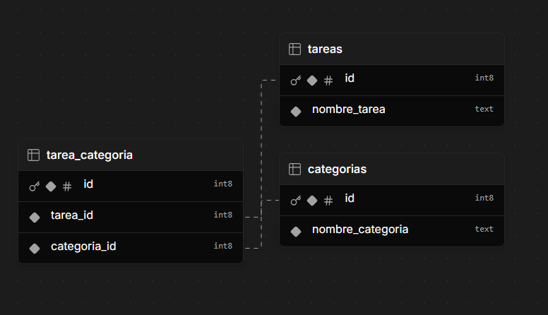

# Demo App Tareas

## Descripción
Este proyecto es una sencilla aplicación de tareas, donde se pueden crear y eliminar tareas. Las tareas llevan asociadas categorías.
He utilizado un nuevo proyecto Laravel con Livewire para la parte dinámica y TailwindCSS para el diseño.

# Requerimientos
***Importante***:

La aplicación necesita de una base de datos MySQL para funcionar. Se debe configurar la conexión a la base de datos en el archivo .env

## Tecnología utilizada

- Laravel 12
- PHP 8.2x
- Livewire 3.6
- TailwindCSS v4
- Laravel installer 5.11.2
- MySQL 8.0
- Composer 2.8.6
- Node 22.7.0
- NPM 10.9.2

## Contenido del proyecto

El código del proyecto Laravel se encuentra en la carpeta **src**


## Lógica de la base de datos



## Instalación

1. Clonar el repositorio
```bash
git clone repositorio
```
2. **IMPORTANTE** - Situarse en la carpeta del proyecto de Laravel
```bash
cd src
```
2. Instalar dependencias
```bash
composer install
npm install && npm run build
```
3. Crear archivo .env
```bash
cp .env.example .env
```
4. Generar clave de aplicación
```bash
php artisan key:generate
```
5. Configurar la base de datos en el archivo .env
```bash
DB_CONNECTION=mysql
DB_HOST=
DB_PORT=
DB_DATABASE=
DB_USERNAME=
DB_PASSWORD=
```
6. Ejecutar migraciones
```bash
php artisan migrate
```
7. Ejecutar seeders
```bash
php artisan db:seed
```
8. Iniciar servidor
```bash
php artisan serve
```

9. Acceder a la aplicación en el navegador
```bash
http://localhost:8000
```
